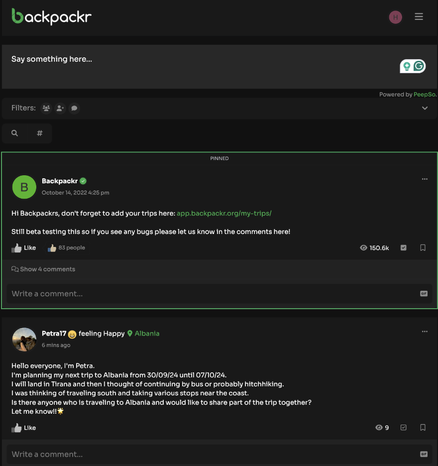
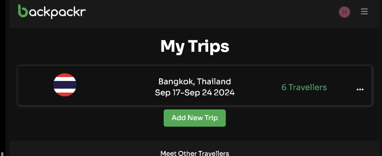
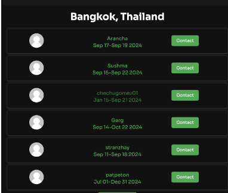
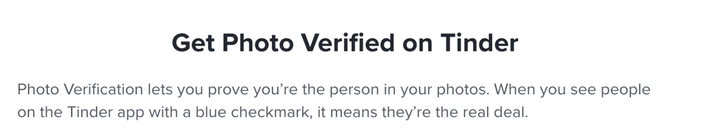
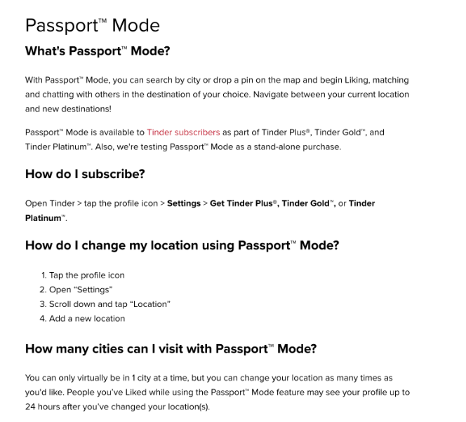
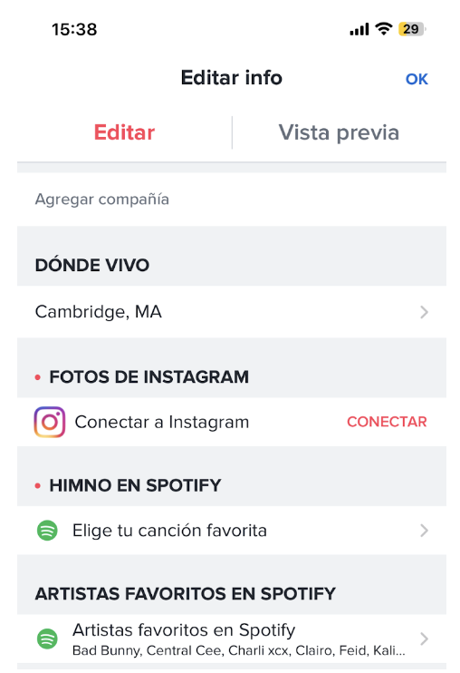
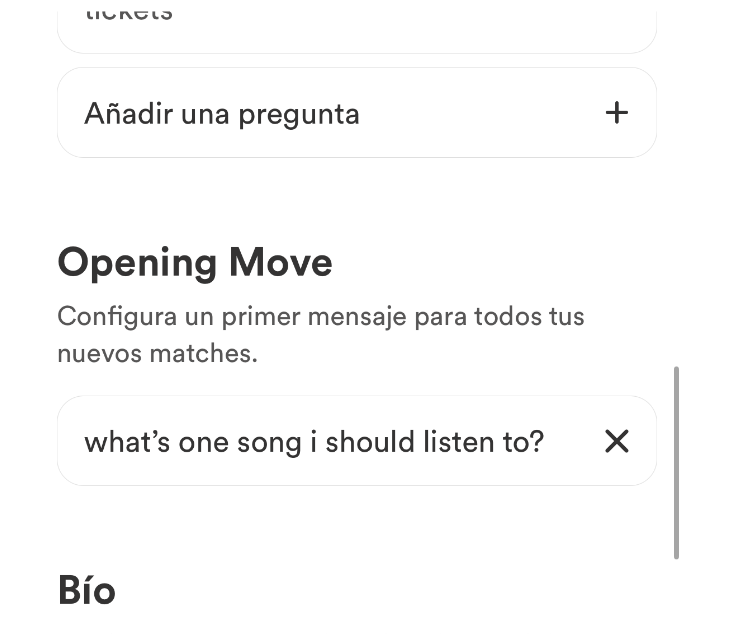
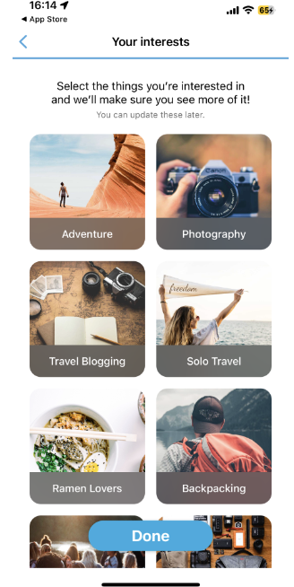
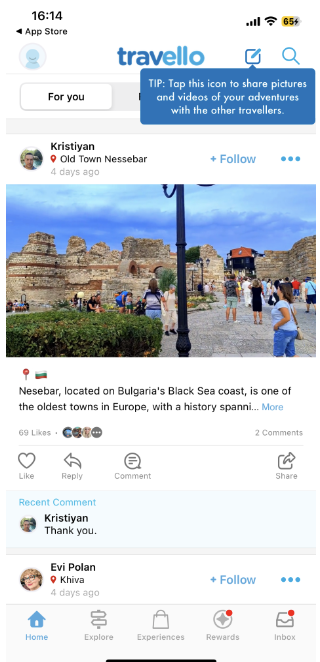
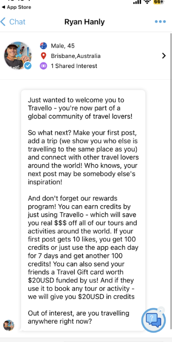

# Assignment 2

## Broad Application Goals: 
#### Name: Nomadly 
- For all the nomads :))

#### Audience: 
- Travelers (mainly backpackers, but open to luxury travelers, expats, eco-tourists, digital nomads, volunteer travelers – could look into the goals and interests of each of these groups)

#### Value: 
- Nomadly would be an application for matching, connecting, and meeting other travelers abroad. 
- Possible value: Nomadly uses a similar interface to dating apps to make matching and connecting simple for its users.
(possibly locals wanting to interact with travelers; e.g. practice their English with other people – an idea I can look into if I have time) to socialize with

## Scrapbook of Comparables:
### Backpackr
- Backpacking app to “find others travelling to the same destination, collect virtual stamps and share photos with friends as you go” (from homepage)

#### Home Page
- Interface of general community postboard to meet backpackers or post where you are going to travel to where you can view posts of all users (community), those you follow, or those you have saved.
- Can we also implement a version of “following” within our app (which differs compared to other dating apps) to maintain connections with those you have matched with (as mentioned with Manuel and Lydia’s interview)

#### My Trips page
- Allows for people to organize where they are going to and once you have submitted a trip, you can see how many other travelers on backpackr are also going during your same time (can press 6 travelers to then get their profiles and contact them about meeting up)
Could we implement a similar tracker of trips for people, but also possibly including details of what cities/countries are most popular so if people want to travel somewhere where there are lots of other travelers (spontaneous backpackers), they can aim for those locations?
- How can we make the contact page more efficient so if there are hundreds of contacts, it is easier to organzie? Can we have a matching algorithm for travelers the system feels best suits your travel needs?

#### Profile Page of users
Allows people to view how long a member has been on the app, their followers/following, profile views, an option to “like” their profile (which differs than the follow button), see their posts (streams), their “about” description, etc.
How can we expand the content in the “About” section to suit what travelers would be most curious about (what kind of traveler are you, what are you interested in doing, etc)

### Tinder
- Dating app that allows you to match with people either by swiping left (no) or right (yes) based on a person’s photos, passions, general description, response to prompts

#### Photo verification on Tinder
- Safety measure that is optional on Tinder that allows people to prove if they are the person in the photos
- Can we make this photo verification required for Nomadly to ensure safety for our users? Can/should we implement another form of verification through passports, or would that be “too much” and make users uncomfortable?

#### Tinder Passport Feature
- Paid Tinder feature that allows people to change their location and match with people in different cities
    - Manuel said he used this feature to match with people before he got to a location so he would have people to meet as soon as he arrived to a city
- Would it make sense for our app to have this as a paid feature? Can we expand this and allow people to be in “more than 1 city at a time” to see where they connect with people the best (and ultimately could decide to travel there?

#### Tinder Communities
- On the Tinder “Explore” page, there are communities specifically for the type of person you are interested in finding (“finding love” “I’m free today”, “Friends first”, “going for coffee”) or based on their profile’s interests to join if you want to only swipe on people that are in a certain community
- How can we make a feature like this more accessible? I don’t believe this feature is commonly used on Tinder (I didn’t know it existed until today) Are there communities specific to traveling we should have in an explore feed instead (perhaps type of traveler you are)?

#### Edit Profile: Connecting to other forms of social media
- Being able to connect one’s Instagram and show pictures from your Instagram on your profile
- Being able to connect your Spotify and list your favorite artists
- Are there forms of social media that we could connect Nomadly’s profiles to that would allow users to better connect/demonstrate interests/human-ize their profiles? 
- Connecting Instagram seems to be a better way to human-ize a profile to prove that someone is “real” and not a scam

#### Tinder Profile Viewing Features
- Able to rewind (see the last viewed profile), skip (swipe left), super like (swipe up and be able to write a note to the user when they see your profile), like (swipe left), and boost (power-up feature that allows more people to view your profile during a certain time; limited number of boosts)
- Are there any “power-up” features that are relevant to Nomadly (I wouldn’t think so but I can brainstorm more)? I don’t think Superlike would be as relevant since this is not a dating app.

#### Profile Viewing (Tinder’s Version)
- Profile shows first photo of individual (where you can then press right to see their other photos), their name, age, whether they are photo-verified, if they have already liked your profile, and their bio (sometimes their location and job if bio is not written). You have to press the small arrow button to see their full profile.
- Having profile viewing like this makes matching more based on looks rather than their details/personality. Having a bio and answering prompts can be good for learning more about a person’s personality, but how can we make sure their information comes across just as much as their photo?

#### Tinder Profile Viewing Features
- As described in [Tech Crunch](https://techcrunch.com/2022/01/06/tinder-is-developing-a-feature-called-swipe-party-that-invites-friends-to-join-your-swiping-sessions/?guccounter=1#:~:text=According%20to%20details%20spotted%20in,already%20a%20popular%20offline%20activity), the feature allows for your friends to see and hear while you look through prospects on the Tinder app.
Having multiple people view a profile at once could be interesting for group meet-ups. Perhaps the app could have a method of linking groups together and people can swipe on a group rather than an individual as well. The group would then get the same list of matches to swipe themselves and the group would need to collectively decide to swipe on someone to match with them.

### Bumble

#### Opening Move
- Option on profile to write an opening move message that is given to all your new matches to start a conversation
- I really think this is a good way to break the initial awkward silence of first matching with someone. Perhaps we can have set opening moves based on travel (what has been your favorite place you’ve visited? Where are you most excited to visit in your current city?) since these opening moves will be more targeted to the travelers and potentially lead to making plans to do certain activities.

#### Interests (Bumble’s Version)
- A popular feature in almost all dating apps; a user can choose interests on their profile to demonstrate their hobbies and passions
- Manuel and Lydia noted how it could be cool to have a type of interests but based on the style of traveling, kind of traveler you are, etc. for Nomadly.

### Travello

#### Interests (Travello’s Version)
- Interests (not organized by category like Bumble) which has around 12 options of different interests relating to travel
- Super cool start of how Nomadly would have interests? How can we merge this with how Bumble organizes interests to make a wider breadth of interests?

#### Home Page
- Similar to Backpackr, users can post blogs about their travels, where other users can like, comment, reply (similar to comment but also @’s the main user), and share. People can link the location, use photos, and use hashtags
- Travel apps like Backpackr and Travello seem to use this blog-format a lot. This could perhaps be an additional use of Nomadly, since also seeing hashtags and searching for certain locations can help people discover other users, alongside the general swiping of profiles.

#### Experiences Page
- You can put your location and see different activities to do in those areas. Based on Travello’s own “rewards” system for cash with certain tours, you can get discounted offers based on earning more likes on your posts, having a “streak” of using the app, etc.
- Being able to get discounts from tours seems unrealistic to do in a semester, but perhaps having Nomadly could have a section with an array of different tours, popular restaurants, museums. People could possibly list those interested activities on their profile in a way that people that also are curious about doing those activities could use that as a way to meet people(?)

#### Chats
- Similar Chat function to all other dating apps, but with added functions such as sending photos (which you can’t do on some dating apps), GIFs, and location sharing. You can also see a brief version of the person’s bio at the top of the screen. 
- Location sharing would be a good function to have to meet someone. What are other possible unique features within Nomadly’s chat that could be useful?

#### Map Page
- Map where Travello organizes their community posts based on locations on a map, where you can press certain cities and see posts from that city.
- Within my interviews, we talked about an idea about a map function. However, how can we utilize this map basis but have it be in regards to matching with people. It could mark what countries people you follow are in, or even highlight activities to do in that area. I would need to brainstorm an effective way of using a “map page” to the best use of my users.
