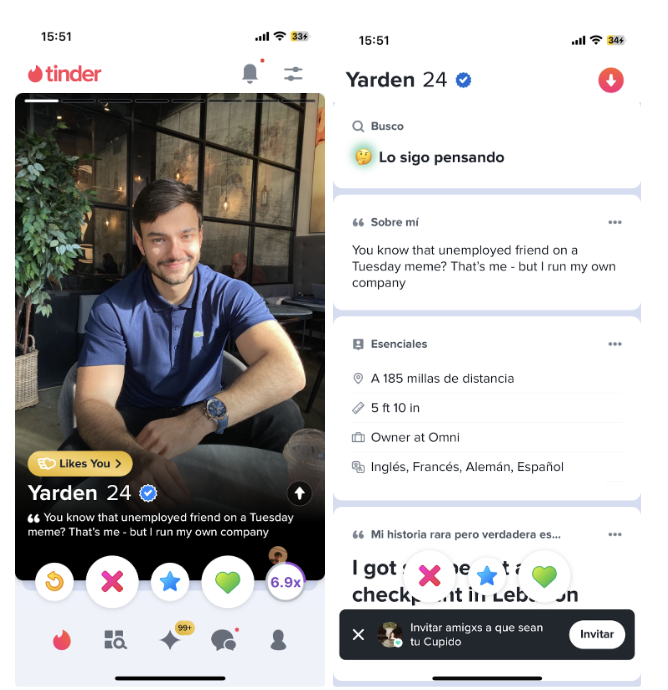

# Assignment 3

## Pitch 
Nomadly is an app that allows travelers to connect. Users can swipe left to not match with an individual, and swipe right and subsequently write a message to match with an individual. Nomadly will first ask the user general questions and then have the user be evaluated based on several questions relating to their personality and travel goals. When going through each profile with either a like or dislike, each user will have a percentage attached to their profile that correlates with their “compatibility” with another user. Profiles will include a bio, general information, general travel-related details, and answers to prompts.

Once matched, users will have a chat to interact with their matches. Users can then propose a meet-up, which includes a location and time to meet that person. Before or when proposing a meet-up, users can include another individual’s number as an emergency contact. 

Nomadly also includes a map page that has the general locations of where users are/have set their location to, so users can easily see where their previous matches are now.

## Functional Design: 
- Travelers (mainly backpackers, but open to luxury travelers, expats, eco-tourists, digital nomads, volunteer travelers – could look into the goals and interests of each of these groups)

### Concept: Authenticating

**Purpose:** Authenticate users to develop profile for users to correspond with other users.

**Principle:** After a user registers with a username and password pair, they can authenticate as that user by providing the pair:
- `register (n, p, u); authenticate (n, p, u') {u' = u}`

**State:**
- **registered:** set User
- **name, username, password:** registered → one String
- **name:** Name
- **gender:** Gender
- **age:** int Age
- **travel_style:** Travel_Style
- **location:** Location
- **question_1:** Question_1
- **question_2:** Question_2
- **gender, age, travel_style, question_1, question_2, location:** qualities → one JSON

**Actions:**
- `register (name, username, pass: String, out user: User)`
- `authenticate (username, pass: String, out user: User)`
- `survey(gender, age, travel_style, question_1, question_2, location: String, out qualities)`

**Additional Description:** Each is registered with their name, username, and password. For the authenticating, you need your username and your password to sign in as a user. After authenticating, the user will have to take a survey in which the user can input their gender, age, travel_style, location (whether it be their real-time location or selected location), and then a quick test to gather information about the user, which are outputted as general qualities of the user.

---

### Concept: Sessioning

**Purpose:** Enable authenticated actions for an extended period of time.

**Principle:** After a session starts (and before it ends), the getUser action returns the user identified at the start
- `start (u, s); getUser (s, u') {u' = u}`

**State:**
- **active:** set Session
- **user:** active → one User

**Actions:**
- `start (user: User, out sess: Session)`
- `getUser (sess: Session, out user: User)`
- `end (sess: Session)`

---

### Concept: Rating

**Purpose:** Rate other users based on their profile to correspond with other users.

**Principle:** User views profile of person which includes their potential match calculation from qualities, then user rates profile. If both users "like" each others’ profile, they will "match." If not, then there will be no match.

**State:**
- **qualities:** one JSON
- **userID:** set User
- **potmatch_userID:** map User → set User
- **rating:** map (userID, potmatch_userID) → out bool matchCalc
- **isMatch:** map(userID: rating, potmatch_userID: rating, out bool isMatch)

**Actions:**
- `calculatePotentialMatch (userID: User, potmatch_userID: User, out matchCalc: int)`
- `showProfile (userID: User, potmatch_userID: User, qualities JSON, matchCalc int)`
- `rateProfile (userID: User, potmatch_userID: User, like: Bool)`
- `isMatch (User, User) → bool`

**Additional Description:** Rating is where we will use the qualities which are set via a JSON file and each user is set with a userID. Then, each user can be mapped with a potential match (other user) ID, or the potmatch_userID, where it is calculated how compatible they are. Based on that matchCalc int, the user will be displayed the profiles they are most compatible with. Then, the actual rating (whether the person likes or dislikes another person’s profile) will output a bool matchCalc (1 for like, 0 for dislike). People are matched, or isMatch, when it checks if both people have both liked each other (1 for each), in which they are now a confirmed match (1 if confirmed match, 0 if not confirmed match).

---

### Concept: Chatting

**Purpose:** Matched users can converse with each other.

**Principle:** Once two users are confirmed matches (confirmMat is true), then they can initiate a private chat, where they can start the chat, send messages, receive messages, and end the chat session.

**State:**
- **registered:** set User
- **Messages:** map (User, User) → list messages
- **isMatch:** (User, User) → bool
- **matchedUserID:** set User
- **senderID:** set User
- **receiverID:** set User

**Actions:**
- `startChat (userID: User, matchedUserID: User, out chatSession)`
- `sendMessage (chatSession, senderID: User, message: String)`
- `receiveMessage (chatSession, receiverID: User, out message: String)`
- `endChat (chatSession)`

**Additional Description:** Two users can startChat() and then those two users can send string values through sendMessage() based on a the the ID of the sender. Additionally, the receiveMessage() for someone would be based on a receiverID with a same string. Then, the session can end with endChat().

---

### Concept: Meeting

**Purpose:** Allows users to propose and confirm meetings safely, while providing safety measures for the meeting.

**Principle:** A user will propose a meeting by specifying a date, time, and location, which the other user can then approve. An emergency contact is provided by each user and notified if the user does not confirm their safety within a set time after the meeting starts.

**State:**
- **proposerID:** set User
- **receiverID:** set User
- **date:** Date
- **time:** Time
- **location:** String
- **proposedMeeting:** map (User, User) → list MeetingInfo
- **confirmedMeeting:** map (MeetingID) → Meeting
- **deniedMeeting:** map (MeetingID) → Meeting
- **emergencyContacts:** map (User) → String
- **meetingID:** map(Meeting) → MeetingID
- **scheduledTime:** Time

**Actions:**
- `proposeMeeting (proposerID: User, receiverID: User, date: Date, time: Time, location: String, out meetingDetails)`
- `confirmMeeting (proposerID: User, receiverID: User, date: Date, time: Time, location: String)`
- `denyMeeting (proposerID: User, receiverID: User, date: Date, time: Time, location: String)`
- `setEmergencyContact (userID: User, phone_number: String)`
- `emergencyCheck (meetingID: Meeting, scheduledTime: Time)`

**Additional Description:** proposeMeeting() will allow a user to propose a meeting specifying the date, time, and location. This is then stored and confirmed or denied by the receiving user. When confirmed, we can then set an emergency contact number and emergencyCheck which will schedule a time for the user based on the meetingID assigned to that meeting.

---

### Concept: Locating

**Purpose:** Allows users to view real-time or periodically updated locations of matched users on a global map.

**Principle:** Once users have matched, they can opt-in to share their location data. This info is then used to display their current city on a global map accessible to only their matches. Locations shared will show only general locations such as city centers or major landmarks for the privacy of those users.

**State:**
- **matchedUserID:** set User
- **userLocations:** map (User) → Location
- **locationDetails:** map (Location) → JSON
- **time:** Time

**Actions:**
- `approvedLocationShare (userID: User) → bool`
- `updateLocation (userID: User, location: Location, time: Time)`
- `showLocation (matchedUserID: User, viewerID: User, out locationDetails: JSON)`

**Additional Details:** approvedLocationShare() will have the IDs of the users who approve to have their location shared within the app. For updateLocation(), the specific userID and location will be updated based on the time. Then for showLocation(), then a viewer will be able to see the matchedUserID of those who have decided to share their location. This should check whether this person is a matchedUser and also approvedLocationShare() is true. Then, there will be location details based on the closest city center.

#### Value: 
- Nomadly would be an application for matching, connecting, and meeting other travelers abroad. 
- Possible value: Nomadly uses a similar interface to dating apps to make matching and connecting simple for its users.
(possibly locals wanting to interact with travelers; e.g. practice their English with other people – an idea I can look into if I have time) to socialize with

## Scrapbook of Comparables
### Backpackr
- Backpacking app to “find others travelling to the same destination, collect virtual stamps and share photos with friends as you go” (from homepage)

#### Home Page
- Interface of general community postboard to meet backpackers or post where you are going to travel to where you can view posts of all users (community), those you follow, or those you have saved.
- Can we also implement a version of “following” within our app (which differs compared to other dating apps) to maintain connections with those you have matched with (as mentioned with Manuel and Lydia’s interview)

#### My Trips page
- Allows for people to organize where they are going to and once you have submitted a trip, you can see how many other travelers on backpackr are also going during your same time (can press 6 travelers to then get their profiles and contact them about meeting up)
Could we implement a similar tracker of trips for people, but also possibly including details of what cities/countries are most popular so if people want to travel somewhere where there are lots of other travelers (spontaneous backpackers), they can aim for those locations?
- How can we make the contact page more efficient so if there are hundreds of contacts, it is easier to organzie? Can we have a matching algorithm for travelers the system feels best suits your travel needs?

#### Profile Page of users
Allows people to view how long a member has been on the app, their followers/following, profile views, an option to “like” their profile (which differs than the follow button), see their posts (streams), their “about” description, etc.
How can we expand the content in the “About” section to suit what travelers would be most curious about (what kind of traveler are you, what are you interested in doing, etc)

### Tinder
- Dating app that allows you to match with people either by swiping left (no) or right (yes) based on a person’s photos, passions, general description, response to prompts

#### Photo verification on Tinder
- Safety measure that is optional on Tinder that allows people to prove if they are the person in the photos
- Can we make this photo verification required for Nomadly to ensure safety for our users? Can/should we implement another form of verification through passports, or would that be “too much” and make users uncomfortable?

#### Tinder Passport Feature
- Paid Tinder feature that allows people to change their location and match with people in different cities
    - Manuel said he used this feature to match with people before he got to a location so he would have people to meet as soon as he arrived to a city
- Would it make sense for our app to have this as a paid feature? Can we expand this and allow people to be in “more than 1 city at a time” to see where they connect with people the best (and ultimately could decide to travel there?

#### Tinder Communities
- On the Tinder “Explore” page, there are communities specifically for the type of person you are interested in finding (“finding love” “I’m free today”, “Friends first”, “going for coffee”) or based on their profile’s interests to join if you want to only swipe on people that are in a certain community
- How can we make a feature like this more accessible? I don’t believe this feature is commonly used on Tinder (I didn’t know it existed until today) Are there communities specific to traveling we should have in an explore feed instead (perhaps type of traveler you are)?

#### Edit Profile: Connecting to other forms of social media
- Being able to connect one’s Instagram and show pictures from your Instagram on your profile
- Being able to connect your Spotify and list your favorite artists
- Are there forms of social media that we could connect Nomadly’s profiles to that would allow users to better connect/demonstrate interests/human-ize their profiles? 
- Connecting Instagram seems to be a better way to human-ize a profile to prove that someone is “real” and not a scam

#### Tinder Profile Viewing Features
- Able to rewind (see the last viewed profile), skip (swipe left), super like (swipe up and be able to write a note to the user when they see your profile), like (swipe left), and boost (power-up feature that allows more people to view your profile during a certain time; limited number of boosts)
- Are there any “power-up” features that are relevant to Nomadly (I wouldn’t think so but I can brainstorm more)? I don’t think Superlike would be as relevant since this is not a dating app.

#### Profile Viewing (Tinder’s Version)
- Profile shows first photo of individual (where you can then press right to see their other photos), their name, age, whether they are photo-verified, if they have already liked your profile, and their bio (sometimes their location and job if bio is not written). You have to press the small arrow button to see their full profile.
- Having profile viewing like this makes matching more based on looks rather than their details/personality. Having a bio and answering prompts can be good for learning more about a person’s personality, but how can we make sure their information comes across just as much as their photo?

#### Tinder Profile Viewing Features
- As described in [Tech Crunch](https://techcrunch.com/2022/01/06/tinder-is-developing-a-feature-called-swipe-party-that-invites-friends-to-join-your-swiping-sessions/?guccounter=1#:~:text=According%20to%20details%20spotted%20in,already%20a%20popular%20offline%20activity), the feature allows for your friends to see and hear while you look through prospects on the Tinder app.
Having multiple people view a profile at once could be interesting for group meet-ups. Perhaps the app could have a method of linking groups together and people can swipe on a group rather than an individual as well. The group would then get the same list of matches to swipe themselves and the group would need to collectively decide to swipe on someone to match with them.

### Bumble

#### Opening Move
- Option on profile to write an opening move message that is given to all your new matches to start a conversation
- I really think this is a good way to break the initial awkward silence of first matching with someone. Perhaps we can have set opening moves based on travel (what has been your favorite place you’ve visited? Where are you most excited to visit in your current city?) since these opening moves will be more targeted to the travelers and potentially lead to making plans to do certain activities.

#### Interests (Bumble’s Version)
- A popular feature in almost all dating apps; a user can choose interests on their profile to demonstrate their hobbies and passions
- Manuel and Lydia noted how it could be cool to have a type of interests but based on the style of traveling, kind of traveler you are, etc. for Nomadly.

### Travello

#### Interests (Travello’s Version)
- Interests (not organized by category like Bumble) which has around 12 options of different interests relating to travel
- Super cool start of how Nomadly would have interests? How can we merge this with how Bumble organizes interests to make a wider breadth of interests?

#### Home Page
- Similar to Backpackr, users can post blogs about their travels, where other users can like, comment, reply (similar to comment but also @’s the main user), and share. People can link the location, use photos, and use hashtags
- Travel apps like Backpackr and Travello seem to use this blog-format a lot. This could perhaps be an additional use of Nomadly, since also seeing hashtags and searching for certain locations can help people discover other users, alongside the general swiping of profiles.

#### Experiences Page
- You can put your location and see different activities to do in those areas. Based on Travello’s own “rewards” system for cash with certain tours, you can get discounted offers based on earning more likes on your posts, having a “streak” of using the app, etc.
- Being able to get discounts from tours seems unrealistic to do in a semester, but perhaps having Nomadly could have a section with an array of different tours, popular restaurants, museums. People could possibly list those interested activities on their profile in a way that people that also are curious about doing those activities could use that as a way to meet people(?)

#### Chats
- Similar Chat function to all other dating apps, but with added functions such as sending photos (which you can’t do on some dating apps), GIFs, and location sharing. You can also see a brief version of the person’s bio at the top of the screen. 
- Location sharing would be a good function to have to meet someone. What are other possible unique features within Nomadly’s chat that could be useful?

#### Map Page
- Map where Travello organizes their community posts based on locations on a map, where you can press certain cities and see posts from that city.
- Within my interviews, we talked about an idea about a map function. However, how can we utilize this map basis but have it be in regards to matching with people. It could mark what countries people you follow are in, or even highlight activities to do in that area. I would need to brainstorm an effective way of using a “map page” to the best use of my users.

### We3
- Friend matching app which focuses on matching people in groups of 3

#### Profile Question: Gender matching
- Profile general questions ask what gender the user would be open to matching with
- This is an idea Lydia mentioned! However, I think Nomadly should have more options in terms of gender.

#### Matching Tests
- We3 does not swipe on profiles, but instead has 5 levels of test including questions and follow-up questions similar to a “dating app swipe” style to learn more about the user. We3 then uses a matching algorithm based on these responses.
- This is a really creative way to revamp the dating app swipe process. Perhaps Nomadly could have a similar function in terms of needing to match for the algorithm, and then put the general interests from these questions on the profile (where a person can choose to hide or share those answers to the questions), and then be able to swipe on people, that also has a marker of what percent match a person is to your profile.

#### We3 Matching System
- We3 matches people in groups of three in an effort to rid of the awkward 1-on-1 scenarios and have it be more fun for people to match within a group. You press a button to “Match Me” and then the algorithm will sorry you into a group, saying the percent compatible and then what interests, goals, possible activities, etc. you and the group might like. You can then choose to start a group or reject a group, either by indicating who in the group you do not prefer or because of distance. 
- Perhaps Nomadly could have a function for those who want to meet in a group, since I know activities such as bar crawls are popular with big groups. There can be a group match function, though the details (how many people in a group) can be sorted later. 

### Been
- App to track what countries you have traveled to 

#### Select Page
- Page that allows you to add what countries you have been to/lived in/wish to travel to, and demonstrate it on a world map, which also gives stats of what percent of the world you have visited/lived in/wish to travel to and how many countries you have visited/lived in/wish to travel to. 
- Nomadly could have a version of this feature where travelers mark this, and then the app can aim to give them suggestions based on countries on their wish list, or aim to give them matches from those areas if a person decides to want to match with people all over the world (people should have the option to match with people all over the world or just in one specific area they are traveling to).

#### Compare Page
- Page to compare your stats with other people’s stats on tavel through local profiles, file, or QR
- Nomadly could use a similar concept of sharing statistics but possibly through something already demonstrated within their profile when it is shown to another user, since sending files and QR may be difficult when people are further away. 

### HelloTalk
- App to communicate with others to practice language learning -- essentially a learning language partner app

#### Voice Rooms
- Voicerooms for HelloTalk allow users to join community rooms and practice speaking and listening skills in an open-invite space. Users can set which language they want to focus on, and begin their own voiceroom on whatever topic or level of fluency they are.
- Nomadly could use a similar concept of open-invite community rooms for travelers who want to plan events, and there could be a specification on language since travelers may be from all different areas of the world. 

### SplitWise
- App to track expenses and bills when shared between multiple people

#### Genral Interface (Splitting a Bill)
- Splitwise allows you to create groups and include members in a group, where you mark what you spent and what amount, and then it can be split amongst the select members in a group equally, in exact amounts, percentages, or adjusted amounts
- A feature like this could be helpful since people are meeting as friends, and it isn’t necessarily a date where one party could pay for the other. Nomadly could use this when trying to split costs of meals or group events with its matches possibly.

## Brainstorming Feature Ideas
### Safety Features
1. **Meet-up Verification**
   - When deciding to meet with another user, the user can input a verification within the app that they will be meeting with someone on a specific day at a specific time and location. This method would allow it to be more convenient to set up certain dates/times of meeting people so people can easily see who they have planned to meet and where, since it could get complicated if one is planning to meet with many people and wants to keep track of who they planned outings with.

2. **Safety Check-in**
   - Nomadly can offer on-demand check-ins that are alerts that will be notified on a person’s device every unspecified amount of time. If a person does not toggle on the check-in that they are safe with a specific password, the safety check-in can alert a predefined list of emergency contacts. This could be extremely important for solo travelers meeting strangers in remote locations.

3. **Meet-up Counter**
   - On a person’s profile, Nomadly could track how many times a person has met up with someone (after verification through meet-up verification). This counter can be shown as a demonstration to a user if a person can be trusted/is legit if they have met up with many people before.

4. **Emergency Services Locator**
   - Nomadly has a feature where it provides important local emergency contact information, whether hospitals, police stations, and embassies embedded within their general map so users are aware of what is around them. These important locations will be highlighted on the map so it is visually easy for people to recognize.

5. **Real-time Local Alerts**
   - Based on locations inputted on your travel tracker for future travels, the app will notify if there are any weather conditions, travel advisories, or local emergencies in that area. This will allow the user to be prepared of any new developments during their travels to ensure their safety.

6. **Gender Specific Option**
   - Similar to We3’s option to see people of the same sex, Nomadly will give a range of genders that the user can toggle if they are comfortable matching with someone of that gender. With that, their feed may also come with a message alongside certain country profiles if it is common that in that country those who are not heterosexual men solo traveling may not be safe.

### Connecting/Chatting Features
7. **Traveler Survey**
   - Alongside the general personality quiz (as used in We3), Nomadly could use an interactive travel survey that has prompts and questions to figure out what type of traveler the user is. The survey results give a rundown to the user, which can then be adjusted if they do not reflect the user's self-view, enhancing the accuracy of travel matches.

8. **Goal-oriented Matchups**
   - Nomadly can maintain a list of common travel goals (like climbing Patagonia or swimming in the Great Barrier Reef) and offer goal-oriented matchups for people who share these aspirations. This feature makes it easier for users to find and plan meetings with individuals who have similar bucket list goals.

9. **Travel Friend Matching Algorithm**
   - The app will use details from the user’s profile and responses from the traveler survey to best match individuals within the app. A matching percentage next to each user's name indicates compatibility, encouraging more meaningful connections. Users can also interact with those who have a lower match percentage to refine the algorithm’s suggestions over time.

10. **Compare Travel Stats**
   - When viewing another user’s profile, users can see which countries both have visited and which are on each other’s bucket lists. This feature encourages conversation and future travel planning with others looking to visit the same places.

11. **Organized Chats**
   - Nomadly chats are categorized into hidden chats, people you’ve met up with before, and people you haven’t met up with. This system, similar to i

12. **Travel Opening Line**
- When matching with someone, a person can write any response to that person’s profile when matching, or they can ask the person an opening line from a list of travel opening lines provided by Nomadly, such as “Where has been your favorite place you’ve traveled to?,” “What has been your most terrifying travel story?”, “If you could be anywhere in the world right now, where would you be?”

### Enhanced Travel Features
13. **Insider Additions**
    - On Nomadly’s map feature, users can contribute to an "Insider Additions" section by posting hidden gems or advice for specific cities or countries. When a user taps on a city, they can access sections for insider advice and discover hidden gems based on previous travelers' experiences. This feature enriches the travel experience by offering valuable, on-the-ground knowledge that might not be available in traditional guides.

14. **Cultural Etiquette Guide**
    - Nomadly's map will also include a "Cultural Etiquette Guide" for each city, providing travelers with essential information on local customs, traditions, and etiquette. This guide helps ensure that travelers can interact respectfully with different cultures, enhancing mutual understanding and reducing cultural missteps.

15. **AI Virtual Travel Buddy**
    - Nomadly will feature an AI-driven travel buddy that can suggest destinations, help plan itineraries, and provide travel tips tailored to the user's interests and travel wishlist. This virtual companion makes planning more interactive and personalized, acting as a resourceful aide for both new and experienced travelers.

16. **Travel Tracker**
    - The Travel Tracker allows users to input their travel dates and log past journeys, complete with the ability to upload photos, videos, and blog entries. These can be shared publicly on their profile or kept private. For future travel dates, the app will suggest profiles of other users who will be in the same area, organized by compatibility percentages, facilitating easy connections on the go.

17. **Flexible Travel Route Tracker**
    - Within the Travel Tracker, the FlexiTracker feature lets users list the countries they plan to visit over a selected period. The app will not only share profiles of other travelers during that time but also suggest an optimized travel itinerary based on the user's destinations of interest. This tool helps in efficient route planning and meeting fellow travelers with similar itineraries.

18. **Travel Activity Feed**
    - Nomadly’s activity feed will display blogs from connections, as well as content tailored to the user's bucket list destinations and travel preferences. This curated feed ensures that users are engaged with relevant activities and potential friends, making the travel planning process both dynamic and personalized.

### Group Travel Features
19. **Itinerary Collaborator**
   - Nomadly could feature a chat function that doubles as an itinerary collaboration tool. This tool would allow group members to vote on travel activities, manage budgets, and discuss the schedule in a structured format. This ensures everyone in the group is on the same page regarding the travel plans, making group travel smoother and more organized.

20. **Community Groups**
   - Nomadly could host a page for open-invite group events, allowing users to either join pre-existing events or start their own. Once users join an event, they are added to a group chat, facilitating communication and planning. This feature is designed to help travelers who haven't matched formally but are interested in participating in larger community gatherings or discussions.

21. **Nomadly Party**
   - This feature allows travelers to form a party and swipe together on potential travel mates. If one party member swipes right, the rest of the party must approve for a match to occur, promoting group consensus. This is ideal for groups looking to expand their network together while maintaining a collective decision-making process.

22. **Nomadly Split Tracker**
   - Within the app's chat function, Nomadly will incorporate a split tracker to manage group expenses. This tool will help travelers keep track of shared costs, ensuring everyone knows how much they owe or are owed, simplifying financial management during group travels.

## VSD Analysis
1. **Safety Check-in (Stakeholders)**
   - **Observation:** The safety check-in feature may have an issue with potential handling of data, since having a hacker leak with access to frequent location tracking and emergency contact alerts would be harmful to the users.
   - **Design Response:** Implement adjustable privacy settings to allow users to choose how much information is shared and with whom. The data can also be encrypted and that users are informed about how their data is used and stored for the comfort of the user.

2. **Long-term Impact of Travel Buddy Wishlist (Time)**
   - **Observation:** While the Travel Buddy Wishlist encourages travel planning and connections, over the long term, it may contribute to overtourism in popular destinations and most users may just only visit the same few cities.
   - **Design Response:** Introduce features that encourage off-season travel or promote less-known locales alongside popular destinations to distribute travel impacts more evenly over time and space. This could be done through an implementation of having a weekly city spotlight on people’s feed that highlights a city that is not as widely visited by users.

3. **Implications of Real-Time Local Alerts (Pervasiveness)**
   - **Observation:** If the Real-Time Local Alerts feature are widely used, especially in areas that are a bit more prone to incidents, it might lead to a heightened sense of anxiety or dependence on technology for safety for the traveler.
   - **Design Response:** Balance the alert system with controls that allow the user to customize the frequency and types of alerts they receive to reduce potential anxiety and unnecessary alarms that may disturb the user’s travel experience.

4. **Gender Specific Option (Values)**
   - **Observation:** Though made to enhance inclusivity and safety, it may unintentionally segregate or isolate certain user groups if not inclusively designed well based on how the feature is presented.
   - **Design Response:** Regularly update the app’s gender options and safety messages to reflect a broad spectrum of sexualities, gender, and other identities. Nomadly should continually update its gender options to include a wide array of identities. And with safety messages, the user should be able to choose whether they receive certain forms of safety alerts based on their own comfort level rather than it being automatic based on gender.

5. **Insider Additions (Pervasiveness)**
   - **Observation:** "Insider Additions” sharing of hidden gems can lead to overcrowding and over-tourism in areas that are more dear to locals who do not want certain areas to have an influx of tourists.
   - **Design Response:** Nomadly could develop a moderation system on the “hidden gems” shared and possibly ask for guidance from local tourism boards or research from locals (probably not something I can do in one semester) on areas more/less prone to tourists.

6. **Route Tracker & Travel Bucket List (Values)**
   - **Observation:** The Route Tracker and Travel Bucket List could encourage extensive travel from certain routes or inspiration of other travels, which could lead to an increase the carbon footprint of users, and conflict with concerns over the environment.
   - **Design Response:** Integrate a carbon offset feature that calculates the environmental impact of proposed travel plans based on estimations (possibly better estimations if there is an additional feature where users can input their flights and the app can guesstimate the carbon emissions of the flight). This will help users be aware of the carbon footprint. Alongside this number, there can be a tips button where users can press and look into ways to avoid increasing their carbon footprint (different suggestions of forms of travel or donating/supporting organizations that try to minimize carbon footprint).

## Storyboarding and sketching
### Confirm Meet-up w/Another User

**Important Notes**
- How can this feature be less "clunky" on the interface in terms of design?
- Are there any other details that should be included before and after verifying a meet-up?

### Using Flexible Tracker for Ideal Route Planning

**Important Notes**
- Possible integration of a map: it would make it easier for people to plan flexible trips in countries close to each other
- Is the 3 Route feature the most effective? I wanted to allow people to easily see options and then have a chance to refresh. 
- Are there any other functions that could be added to the Itinerary Tracker? Other than to edit, delete, and add?