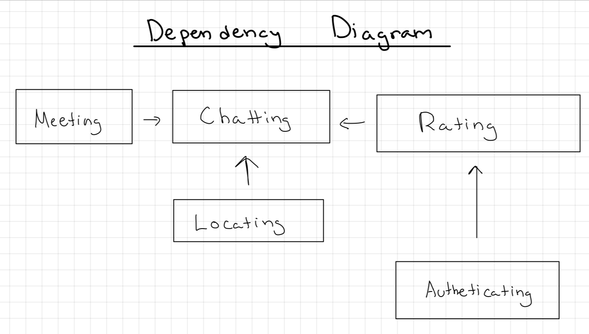

# Assignment 3

## Pitch 
Nomadly is an app that allows travelers to connect. Users can swipe left to not match with an individual, and swipe right and subsequently write a message to match with an individual. Nomadly will first ask the user general questions and then have the user be evaluated based on several questions relating to their personality and travel goals. When going through each profile with either a like or dislike, each user will have a percentage attached to their profile that correlates with their “compatibility” with another user. Profiles will include a bio, general information, general travel-related details, and answers to prompts.

Once matched, users will have a chat to interact with their matches. Users can then propose a meet-up, which includes a location and time to meet that person. Before or when proposing a meet-up, users can include another individual’s number as an emergency contact. 

Nomadly also includes a map page that has the general locations of where users are/have set their location to, so users can easily see where their previous matches are now.

## Functional Design: 
- Travelers (mainly backpackers, but open to luxury travelers, expats, eco-tourists, digital nomads, volunteer travelers – could look into the goals and interests of each of these groups)

### Concept: Authenticating

**Purpose:** Authenticate users to develop profile for users to correspond with other users.

**Principle:** After a user registers with a username and password pair, they can authenticate as that user by providing the pair:
- `register (n, p, u); authenticate (n, p, u') {u' = u}`

**State:**
- **registered:** set User
- **name, username, password:** registered → one String
- **name:** Name
- **gender:** Gender
- **age:** int Age
- **travel_style:** Travel_Style
- **location:** Location
- **question_1:** Question_1
- **question_2:** Question_2
- **gender, age, travel_style, question_1, question_2, location:** qualities → one JSON

**Actions:**
- `register (name, username, pass: String, out user: User)`
- `authenticate (username, pass: String, out user: User)`
- `survey(gender, age, travel_style, question_1, question_2, location: String, out qualities)`

**Additional Description:** Each is registered with their name, username, and password. For the authenticating, you need your username and your password to sign in as a user. After authenticating, the user will have to take a survey in which the user can input their gender, age, travel_style, location (whether it be their real-time location or selected location), and then a quick test to gather information about the user, which are outputted as general qualities of the user.

---

### Concept: Sessioning

**Purpose:** Enable authenticated actions for an extended period of time.

**Principle:** After a session starts (and before it ends), the getUser action returns the user identified at the start
- `start (u, s); getUser (s, u') {u' = u}`

**State:**
- **active:** set Session
- **user:** active → one User

**Actions:**
- `start (user: User, out sess: Session)`
- `getUser (sess: Session, out user: User)`
- `end (sess: Session)`

---

### Concept: Rating

**Purpose:** Rate other users based on their profile to correspond with other users.

**Principle:** User views profile of person which includes their potential match calculation from qualities, then user rates profile. If both users "like" each others’ profile, they will "match." If not, then there will be no match.

**State:**
- **qualities:** JSON (from profileDetails)
- **ratings:** map (raterID, rateeID) → boolean (true as like, false as dislike)
- **matches:** set (User pairs)
- **potentialMatches:** map (userID) → list potmatch_userIDs
- **matchCalc:** map (userID, potmatch_userID) → integer (compatibility score)

**Actions:**
- `calculateCompat (userID, potmatch_userID, qualities)`
- `rateProfile (raterID, rateeID, like)`
- `checkMatch (raterID, rateeID)`

**Additional Description:** Rating is where we will use the qualities which are set via a JSON file and each user is set with a userID. Then, each user can be mapped with a potential match (other user) ID where it is calculated how compatible they are. Based on that calculateCompat int, the user will be displayed the profiles they are most compatible with. Then, the actual rating (whether the person likes or dislikes another person’s profile) will output a bool. People are matched when it checks if both people have both liked each other (1 for each), in which they are now a confirmed match

---

### Concept: Chatting

**Purpose:** Matched users can converse with each other.

**Principle:** Once two users are confirmed matches (confirmMat is true), then they can initiate a private chat, where they can start the chat, send messages, receive messages, and end the chat session.

**State:**
- **registered:** set User
- **Messages:** map (User, User) → list messages
- **isMatch:** (User, User) → bool
- **matchedUserID:** set User
- **senderID:** set User
- **receiverID:** set User

**Actions:**
- `startChat (userID: User, matchedUserID: User, out chatSession)`
- `sendMessage (chatSession, senderID: User, message: String)`
- `receiveMessage (chatSession, receiverID: User, out message: String)`
- `endChat (chatSession)`

**Additional Description:** Two users can startChat() and then those two users can send string values through sendMessage() based on a the the ID of the sender. Additionally, the receiveMessage() for someone would be based on a receiverID with a same string. Then, the session can end with endChat().

---

### Concept: Meeting

**Purpose:** Allows users to propose and confirm meetings safely, while providing safety measures for the meeting.

**Principle:** A user will propose a meeting by specifying a date, time, and location, which the other user can then approve. An emergency contact is provided by each user and notified if the user does not confirm their safety within a set time after the meeting starts.

**State:**
- **proposerID:** set User
- **receiverID:** set User
- **date:** Date
- **time:** Time
- **location:** String
- **proposedMeeting:** map (User, User) → list MeetingInfo
- **confirmedMeeting:** map (MeetingID) → Meeting
- **deniedMeeting:** map (MeetingID) → Meeting
- **emergencyContacts:** map (User) → String
- **meetingID:** map(Meeting) → MeetingID
- **scheduledTime:** Time

**Actions:**
- `proposeMeeting (proposerID: User, receiverID: User, date: Date, time: Time, location: String, out meetingDetails)`
- `confirmMeeting (proposerID: User, receiverID: User, date: Date, time: Time, location: String)`
- `denyMeeting (proposerID: User, receiverID: User, date: Date, time: Time, location: String)`
- `setEmergencyContact (userID: User, phone_number: String)`
- `emergencyCheck (meetingID: Meeting, scheduledTime: Time)`

**Additional Description:** proposeMeeting() will allow a user to propose a meeting specifying the date, time, and location. This is then stored and confirmed or denied by the receiving user. When confirmed, we can then set an emergency contact number and emergencyCheck which will schedule a time for the user based on the meetingID assigned to that meeting.

---

### Concept: Locating

**Purpose:** Allows users to view real-time or periodically updated locations of matched users on a global map.

**Principle:** Once users have matched, they can opt-in to share their location data. This info is then used to display their current city on a global map accessible to only their matches. Locations shared will show only general locations such as city centers or major landmarks for the privacy of those users.

**State:**
- **matchedUserID:** set User
- **userLocations:** map (User) → Location
- **locationDetails:** map (Location) → JSON
- **time:** Time

**Actions:**
- `approvedLocationShare (userID: User) → bool`
- `updateLocation (userID: User, location: Location, time: Time)`
- `showLocation (matchedUserID: User, viewerID: User, out locationDetails: JSON)`

**Additional Details:** approvedLocationShare() will have the IDs of the users who approve to have their location shared within the app. For updateLocation(), the specific userID and location will be updated based on the time. Then for showLocation(), then a viewer will be able to see the matchedUserID of those who have decided to share their location. This should check whether this person is a matchedUser and also approvedLocationShare() is true. Then, there will be location details based on the closest city center.

## Synchronization: 
**app** Nomadly

**include** Authentication [User]
**include** Session [Session]
**include** Rating [Rating, Qualities]
**include** Chatting [Chat]
**include** Meeting [Meeting]
**include** Locating [Location]

### When a Survey is Completed
**sync**  `surveyComplete (userID: User, surveyResults: JSON)`
- `Authentication.updateProfile (userID, surveyResults)`
- `Rating.calculateMatches (userID)`

### When a Profile is Liked
**sync** `LikeProfile (userID: User, targetUserID: User)`
- `Rating.registerSwipe (userID, targetUserID, like=true)`
- `Chat.initiateChat (userID, targetUserID)`
- `Locating.showUserOnMap (userID)`

### When Proposing a Meeting
**sync**  `proposeMeeting (proposerID: User, receiverID: User, date: Date, time: Time, location: String)`
- `Meeting.scheduleMeeting (proposerID, receiverID, date, time, location)`
- `Chatting.sendMeetingProposal (receiverID)`

#### When Confirming a Meeting
**sync**  `confirmMeeting (meetingID: MeetingID)`
- `Meeting.confirmMeeting (meetingID)`
- `Notification.notifyMeeting (meetingID)`

#### When Setting an Emergency Contact
**sync** `setEmergencyContact (userID: User, phone_number: String)`
- `Meeting.storeEmergencyContact (userID, phone_number)`

#### When Updating Location
**Trigger:** `updateLocation (userID: User, location: Location)`
- `Locating.updateUserLocation (userID, location)`
- `Locating.showUserOnMap (userID)`

## Wireframes

**First Page, Log in, Sign up**

**Input General Location, Survey, Rating**

**Chat Space, Match, Match - Map**

**Match - Emergency, Locate**

## Design Tradeoffs
### Survey as a concept or feature
I was debating whether for survey to be a concept or a feature for my design. I ultiatemly decided for survey to be a feature rather than a concept because of its independence. I believe that a survey would not be able to be independent from the authenticating concept because within this app, one would not be able to use the survey without first authenticating. 
### General location for locating concept
I was deciding between having actual location (for greater accuracy for users if they are in a big city or niche area) or have a general location (where the app says whether the tourist is in a general area). For the map, considering VSD analysis, I decided on general location for greater user safety since past matches all have each others’ locations if opted in.
location
### Details and qualities as JSON
Originally, I did not consider a JSON and was only going to have the qualities of the users and details of the locations continually called one-by-one. However, after Wednesday’s lecture and OH, I decided to call both as JSON files in order to have a more efficient data handling process,for data to be managed and updated. 
