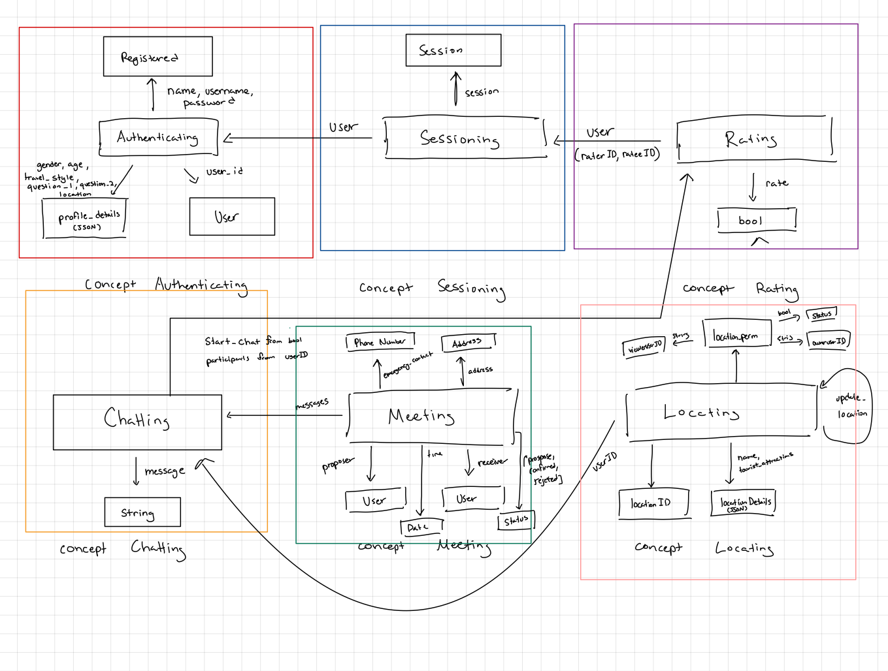
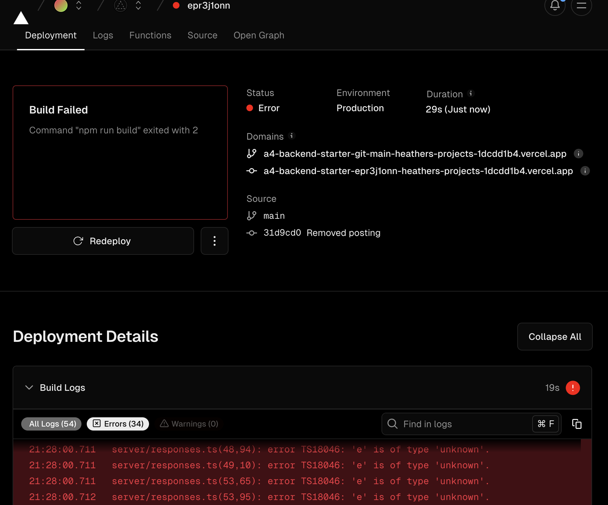
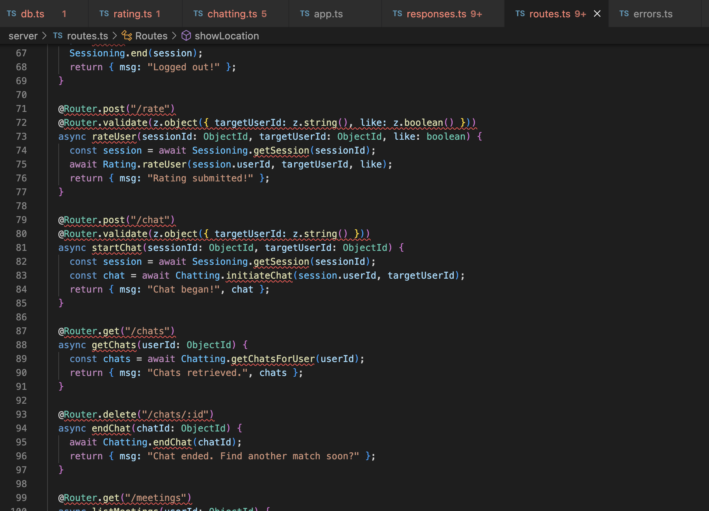

# Assignment 3

## Reformed Concepts 

### Concept: Authenticating

**Purpose:** Authenticate users to develop profile for users to correspond with other users.

**Principle:** After a user registers with a username and password pair, they can authenticate as that user by providing the pair:
- `register (n, p, u); authenticate (n, p, u') {u' = u}`

**State:**
- **registered:** set User
- **credentials:** map (username, password) -> User
- **session:** active session -> User
- **profileDetails** map(gender, age, travel_style, question_1, question_2, location) -> User (JSON)

**Actions:**
- `register (username, password, profileDetails): Creates a new user with unique credentials.`
- `login (username, password): Verifies credentials and initiates a session.`
- `logout (session): Terminates the active session.`

**Additional Description:** Each is registered with their name, username, and password. For the authenticating, you need your username and your password to sign in as a user. After authenticating, the user will have to take a survey in which the user can input their gender, age, travel_style, location (whether it be their real-time location or selected location), and then a quick test to gather information about the user, which are outputted as general qualities of the user.

---

### Concept: Sessioning

**Purpose:** Enable authenticated actions for an extended period of time.

**Principle:** After a session starts (and before it ends), the getUser action returns the user identified at the start
- `start (u, s); getUser (s, u') {u' = u}`

**State:**
- **sessions:** map (sessionID -> User)

**Actions:**
- `startSession (userID): Begins a new session upon user login.`
- `getSession (sessionID): Retrieves an active session.`
- `endSession (sessionID): Ends an active session.`

---

### Concept: Rating

**Purpose:** Rate other users based on their profile to correspond with other users.

**Principle:** User views profile of person which includes their potential match calculation from qualities, then user rates profile. If both users "like" each others’ profile, they will "match." If not, then there will be no match.

**State:**
- **qualities:** JSON (from profileDetails)
- **ratings:** map (raterID, rateeID) -> boolean (true as like, false as dislike)
- **matches:** set (User pairs)
- **potentialMatches:** map (userID) -> list potmatch_userIDs
- **matchCalc:** map (userID, potmatch_userID) -> integer (compatibility score)

**Actions:**
- `calculateCompat (userID, potmatch_userID, qualities)`
- `rateProfile (raterID, rateeID, like)`
- `checkMatch (raterID, rateeID)`

**Additional Description:** Rating is where we will use the qualities which are set via a JSON file and each user is set with a userID. Then, each user can be mapped with a potential match (other user) ID where it is calculated how compatible they are. Based on that calculateCompat int, the user will be displayed the profiles they are most compatible with. Then, the actual rating (whether the person likes or dislikes another person’s profile) will output a bool. People are matched when it checks if both people have both liked each other in which they are now a confirmed match.

---

### Concept: Chatting

**Purpose:** Matched users can converse with each other.

**Principle:** Once two users are confirmed matches, then they can initiate a private chat, where they can start the chat, send messages, receive messages, and end the chat session.

**State:**
- **chats:** map (chatID -> messages)
- **participants:** map (chatID -> set(User))

**Actions:**
- `startChat (user1, user2): Initiates a chat between two matched users.`
- `sendMessage (chatID, message): Sends a message within a chat.`
- `getMessages (chatID): Retrieves messages from a chat.`

**Additional Description:** Two users can startChat() and then those two users can send string values through sendMessage() based on a the the ID of the sender. Additionally, the getMessages() for someone would be based on a receiverID with a same string. Then, the session can end with endChat().

---

### Concept: Meeting

**Purpose:** Allows users to propose and confirm meetings safely, while providing safety measures for the meeting.

**Principle:** A user will propose a meeting by specifying a date, time, and location, which the other user can then approve. An emergency contact is provided by each user and notified if the user does not confirm their safety within a set time after the meeting starts.

**State:**
- **meetings:** map (meetingID -> meetingDetails)
- **participantStatus:** map (meetingID -> status)
- **emergencyContacts:** map (meetingID -> contactDetails)

**Actions:**
- `proposeMeeting (proposerID, receiverID, date, time, location, emergencyContact)`
- `confirmMeeting (meetingID): Confirms a proposed meeting.`
- `denyMeeting (meetingID): Denies a proposed meeting.`

**Additional Description:** proposeMeeting() will allow a user to propose a meeting specifying the date, time, location, and emergency number. This is then stored and confirmed or denied by the receiving user. 

---

### Concept: Locating

**Purpose:** Allows users to view real-time or periodically updated locations of matched users on a global map.

**Principle:** Once users have matched, they can opt-in to share their location data. This info is then used to display their current city on a global map accessible to only their matches. Locations shared will show only general locations such as city centers or major landmarks for the privacy of those users.

**State:**
- **locations:** map (userID -> location data)
- **locationPermissions:** map (ownerID, viewerID) -> permission status
- **locationInfo:** map (location -> details)

**Actions:**
- `shareLocation (userID, location): Updates and shares a user's location with approved viewers.`
- `viewLocation (ownerUserID, viewerUserID): Allows a viewer to see shared locations and learn fun facts about them.`

## Synchronization: 
**app** Nomadly

**include** Authentication [User]
**include** Session [Session]
**include** Rating [Rating, Qualities]
**include** Chatting [Chat]
**include** Meeting [Meeting]
**include** Locating [Location]

### Survey Completed
**sync** `surveyComplete (userID: User, surveyResults: JSON)`
- `Authentication.updateProfile (userID, surveyResults)`
- `Rating.calculateMatches (userID)`

### Profile is Liked
**sync** `LikeProfile (raterID: User, rateeID: User)`
- `Rating.registerSwipe (raterID, rateeID, like=true)`
- `Chat.initiateChat (raterID, rateeID)`
- `Locating.showUserOnMap (rateeID)`

### Propose Meeting
**sync** `proposeMeeting (proposerID: User, receiverID: User, date: Date, time: Time, location: String, emergencyContact: String)`
- `Meeting.scheduleMeeting (proposerID, receiverID, date, time, location, emergencyContact)`
- `Chatting.sendMeetingProposal (receiverID)`

### Confirm Meeting
**sync** `confirmMeeting (meetingID: MeetingID)`
- `Meeting.confirmMeeting (meetingID)`
- `Notification.notifyMeeting (meetingID)`

### Update Location
**sync** `updateLocation (userID: User, location: Location)`
- `Locating.updateUserLocation (userID, location)`
- `Locating.showUserOnMap (userID)`

## Database Diagram

## Concepts Added
## Concepts Added
### [Rating](https://github.com/heather-parkk/a4-backend-starter/blob/main/server/concepts/rating.ts)

### [Chatting](https://github.com/heather-parkk/a4-backend-starter/blob/main/server/concepts/chatting.ts)

## Initial Deployment to Vercel

I think because of the general errors I have been having on my files (probably because I've been overreliant on StackOverflow help, ChatGPT to understand certain lines so I can be able to form my own, examples in class, etc. because of not taking 1020, I have been having trouble with not getting errors in my code)

## RESTful Routes

Example of RESTfulroutes
