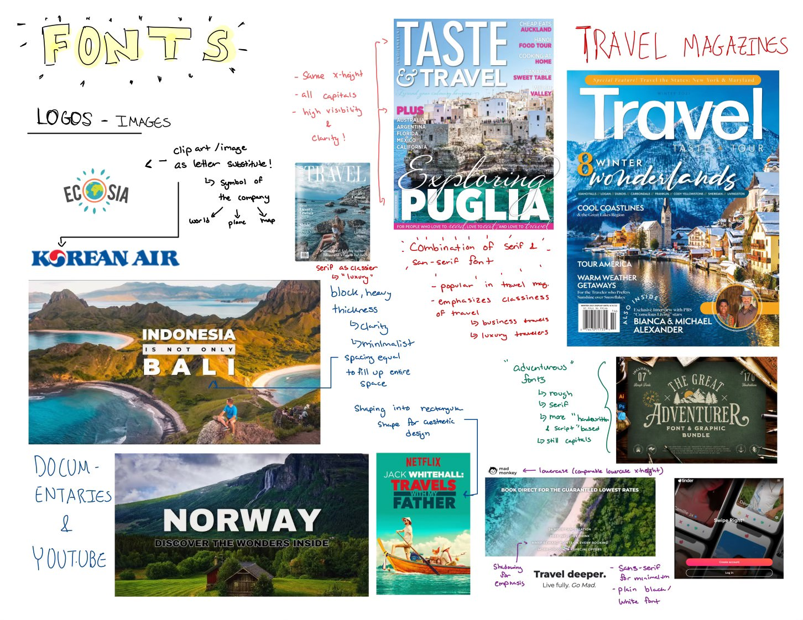
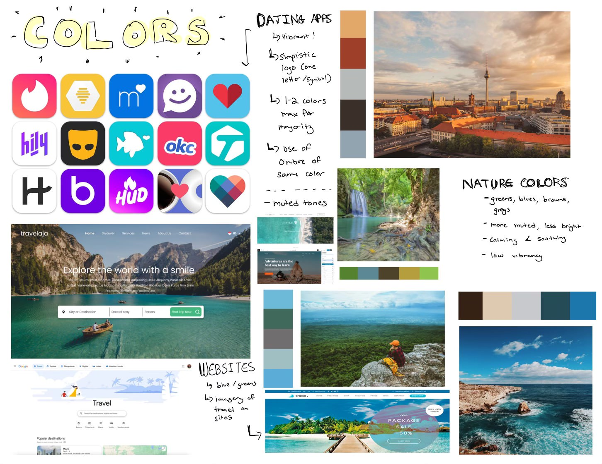

# Assignment 5

### Heuristic Evaluation

### Usability Criteria
#### Discoverability: Ease to understand how to operate the interface
- First Page, Log-in, Sign-up, Input General Location: display standard buttons and fill-in headers (as with the greying of text) 
- Survey should include a page on what the survey is for, the options, vaguely going over what types of questions may be asked (possibly the number of questions)
- Rating: Should make the dislike and like look more like buttons, since they have the same grey color as information on the profile; could possibly have a small tutorial on how to rate and evaluate profiles (which is done in some apps)
- Chat space: includes common set-up of other chats, the bottom icons (which two I left blank to later determine what I will put, possibly a "photo image" to send photos) could be amiguous that the two-person icon means meet-up (could put directions there in a tutorial)
- Locate: Bottom bar shows a chat and world (should've included one for looking through matches, and also possibly looking at one's profile)

#### Pleasantness: "aesthetically-pleasing"ness
- Overall: super minimalistic format, not meant to have unnecessary clutter, classic serif font to have pleasant/calming feel
- Could consider my target audience: these are travelers -- what aesthetic would they find pleasing? This could possibly have too "elegant" (serif font choice) of an aesthetic. Apps like Tinder and Bumble are more vibrant in their scehemes, but aren't necessarily extremely cluttered -> Would have to rethink what "vibe" I want the app to give off -> Maybe more similar to hinge where it isn't technically "elegant" but more minimalistic than Tinder and Bumble

### Physical Heuristics
#### Fitt’s Law: Ease to reach for interface elements
- First-page, Log-in, Sign-up, Input, Survey: Buttons are all top-to-bottom; buttons could be bigger in terms of ease(?)
- Rating: the dislike-like button could be bigger because those are the most important buttons/the purpose of the page; could possibly be fixed to the bottom of the profile since peole's thumbs are closest to there for ease of access instead of by the photos (means people have to scroll all the way back up to dislike-like after seeing a profile)
- Chat Space: follows typical format, buttons for meet-up and photos on the bottom left could be bigger for easier access
- Meet-up wireframes: buttons could be bigger, also follows similar close-together top-down question approach
- Map: could make the user icons bigger since those should be options people can press to go to the profiles of those users --> could be a sacrifice since we also don't want the profiles to be "too" big since they shouldn't be the central focus of the information cities section
#### Gestalt's Principles: Layout conveying conceptual structure
- First-page, Log-in, Sign-up, Input, Survey: top-down approach follows the eye of the reader with the "F" approach we talked about in class
- Map: Could use dots on the "main" cities that the app has information on that are big and clear enough so that people know that if they press those cities they'll get information, not just any random area; separate information from the map with a black border
- Chat Space: follows general structure of other message apps -- has chat and features of the chat close together and grouped so the users knows those are all the chat features, separates the information of the user profile at the top

### Linguistic Level
#### Speak a user’s language: Informative, simple messaging
- First-page, Log-in, Sign-up, Input, Survey: simple phrasing that should be understood by users
- Survey: only has one example question, but I would have to make sure all my questions are very-straightforward and can't be reinterpreted since we only have three options "agree", "neutral", " and disagree"
- Meet-up: User very simple one/two word phrases -- could possibly be more detailed(?) but I believe that users have a general idea of what a meetup entails and I could add general directions at the top to no mess-up with the fill-in sections

#### Information Scent: Hints in navigation
- For Match-map, could include at top: Place the blue circle at the location of where you plan to meet
- For Match, could include directions at the top like "Step #1: Plan the Details", "Step #2: Choose Meet-up Location", "Step #3: Give us an Emergency Contact". Emergency contact should also include a brief description of why the app is asking for this information, and possibly an opt-out option since people may not want an emergency contact given(?) --> Adds more "clutter" instead of a minimalistic feel, but would be a helpful tradeoff for those confused users

## Reactive Components
When developing my components, I had trouble with the final "Locating" and "Chatting" concepts. In terms of chatting, I was struggling in making a connection between the matching and how to connect that to the chatting concept within my repo. For locating, I utilized the ["Leaflet"](https://leafletjs.com/) maps, but was having difficulty in its implementation. Within my code, you cannot see it being displayed, but the Locating vue files are commented out, since with them, it created errors in uploading in Vercel. I was able to create a "SafeMeeting" concept that users are able to fill out, but because I was having trouble to get "Chatting" to work, its usability is flawed.

I troubleshooted by going back to my a4 backend, which allowed me to solve more of the initial problems with sessioning, userProfiling, and Matching (which I was thankful for).

### [Vercel](https://frontend-starter-1obhodtc7-heathers-projects-1dcdd1b4.vercel.app)

### [Github Repo of Front-end](https://github.com/heather-parkk/frontend-starter)

## Visual Study

When going about my visual study, I noticed a use of a variety of fonts to emphasize certain parts of the website, which is why I decided to use a serif "fancier" font when emphasized "Nomad.ly" in the front page, in inspiration of travel magazines. Then, I took inspiration from travel websites in terms of the Homepage and general layout of other fonts. In terms of color scheme, I also based it off of green, blues, and more muted colors in travel images.

I also decided to apply informative, simple messaging in terms of the heuristics for the website. I aimed to apply Gestalt's Principles in terms of grouping information together so it's easy to tell what user's information is regarding which user, and to separate "My Profile" information from "Rating User Profiles" information once done with userProfiling. For most parts, I applied simple top down approaches to given information. 

## Lingering Problems
Overall, I think I am still proud of the amount of coding that I was able to do (alongside the help of ChatGPT for a strong basis of the code), but using my own skills at the helps of TAs during OH to debug. I was wondering in terms of tackling A6, how I should go about it if I still have bugs in my code that flaw the usability of the website.